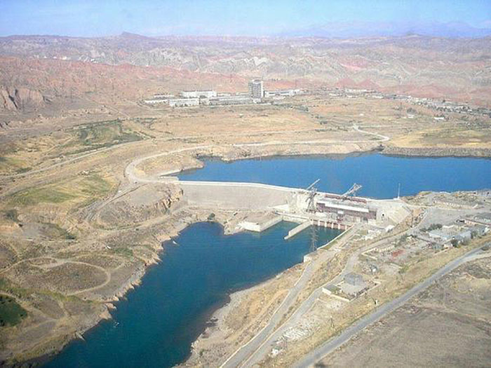

## Родной Шамалды-Сай

Родился я в поселке Шамалды-Сай и прожил там до 7 лет. Эти годы сформировали мои первые воспоминания...

## Гражданская война 2010-2011

Переломный момент наступил, когда в стране начались беспорядки. Наша семья была вынуждена стать беженцами...

## Путь в Россию

Сначала мы оказались в Узбекистане, а затем перебрались к отцу в Ханты-Мансийск...