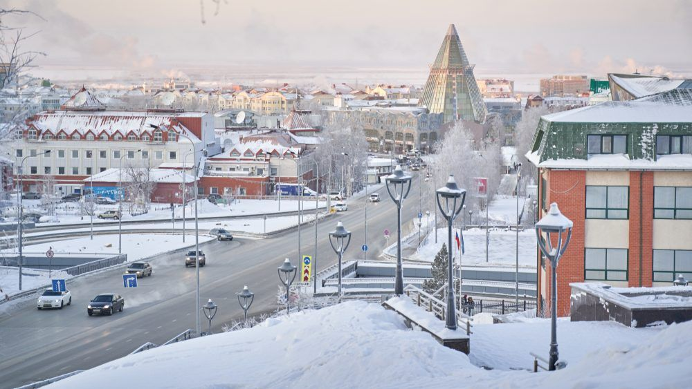

## О городе

Ханты-Мансийск — северный город, окружённый лесами и реками.  
Именно здесь прошло моё детство и юность.  
Здесь я учился, взрослел и делал первые шаги в профессии.

## Учёба

Я учился во второй школе города Ханты-Мансийска.  
Учителя там были строгие, но справедливые — они дали мне дисциплину и привычку доводить начатое до конца.  
Позже я поступил в колледж, где выбрал IT-направление.  
Там начался мой путь в технику, компьютеры и системы.

## Первая работа

После колледжа я нашёл свою первую работу в IT.  
Это был мой старт в сфере, которая потом стала делом всей жизни.

## Эмоции

Ханты-Мансийск — город, с которым у меня связаны самые тёплые воспоминания.  
Он маленький, но уютный. Суровый климат закаляет, а люди там искренние и добрые.

## Вывод

Я благодарен этому городу за всё — за школу, друзей, первую профессию и старт, который дал уверенность в себе.