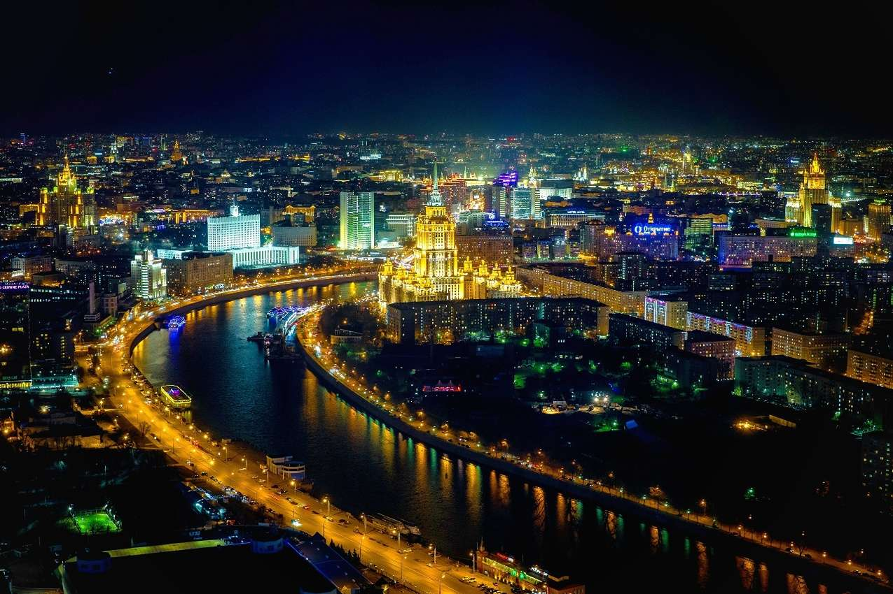

## Почему я решился

Решение переехать в Москву далось непросто.  
Я долго думал, взвешивал риски и возможности.  
Но в какой-то момент понял — чтобы расти, нужно выходить из привычной среды.

## Первые впечатления

Москва встретила меня шумом, скоростью и возможностями.  
Сначала было непросто — новые правила, темп, ощущение, что ты в огромном механизме.  
Но постепенно я нашёл своё место.

## Что мне нравится

Мне нравится ритм города — здесь всё движется, развивается, вдохновляет.  
Много людей, идей, технологий.  
Каждый день можно узнать что-то новое и познакомиться с кем-то интересным.

## Сложности

Были моменты сомнений и усталости.  
Но именно они помогли стать сильнее.  
Я понял, что могу справиться, если иду своим путём.

## Вывод

Переезд стал важной точкой роста.  
Я не только сменил город, но и вышел на новый уровень — профессионально и лично.