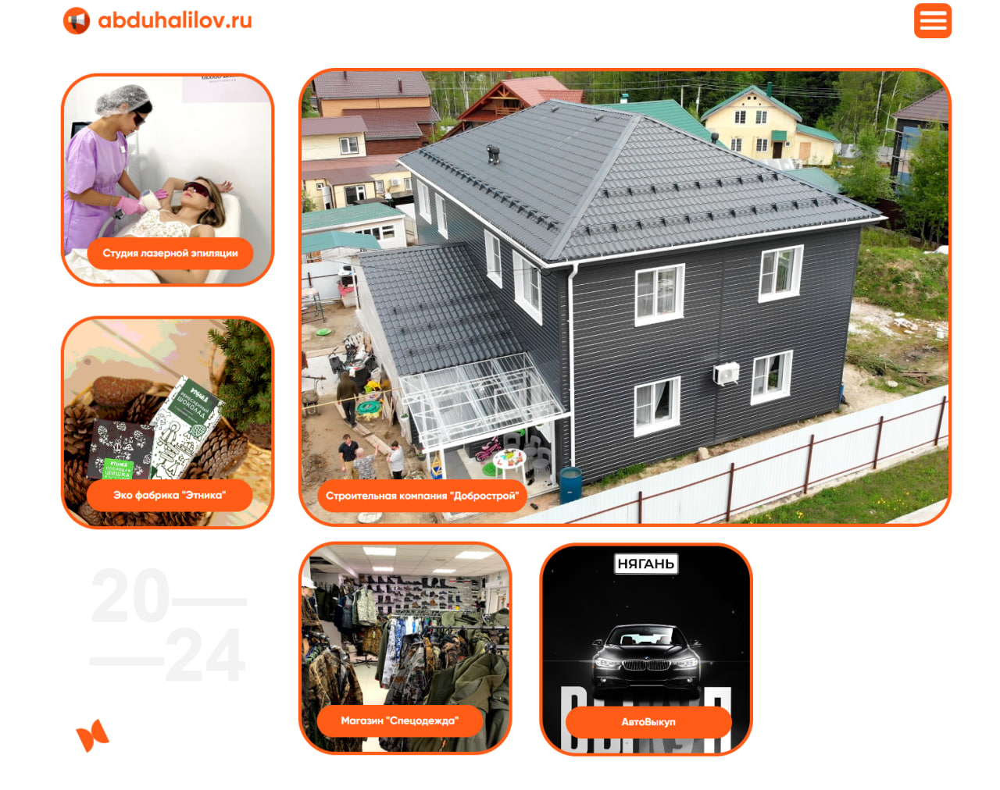

## О проекте

Это мой личный проект, где я создавал сайты, логотипы и внедрял digital-сервисы для малого бизнеса.  
Главная цель — помочь предпринимателям выстроить понятное и рабочее онлайн-присутствие без лишней бюрократии и затрат.

## Моя роль
Создатель и технический руководитель проекта.  
Занимался дизайном, настройкой CMS, интеграцией платёжных систем и аналитики.

## Основные задачи
- Разработка фирменных сайтов на конструкторах и CMS  
- Настройка меню, SEO и подключение доменов  
- Интеграция CRM, онлайн-заявок, чатов, Telegram-ботов  
- Ведение клиентов после запуска (поддержка и обновления)

## Инструменты
Tilda, WordPress, Yandex Cloud, Telegram API, Google Analytics, Яндекс Метрика, Figma, Canva.

## Результаты 

Запущено более 10 сайтов. 
Проект стал отправной точкой для моего дальнейшего профессионального роста в IT.

## Итог 
Я уперся в потолок, когда понял, что малый бизнес не готов платить за сложные решения, а крупные компании требовали иных компетенций и ресурсов. Поэтому данную историю отложил.